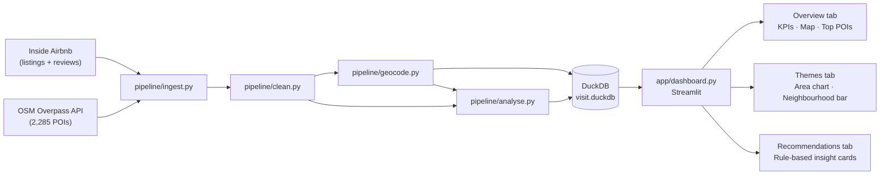
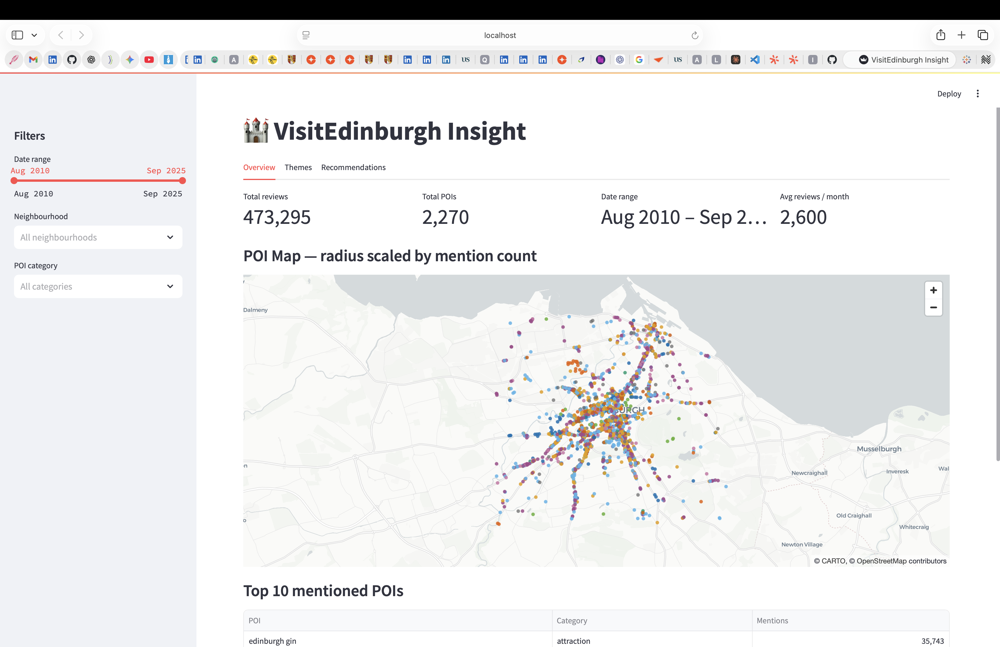

# VisitEdinburgh Insight

> A Python + DuckDB pipeline and Streamlit dashboard that turns 473,295 Airbnb visitor reviews and 2,270 Edinburgh POIs into actionable intelligence for destination marketers.

**🚀 Live demo: https://visit-edinburgh-insight.streamlit.app/**

---

## What this does

- **Ingests and cleans** 559K raw reviews and 2,285 OSM POIs down to a production-quality dataset — filtering non-English text, deduplicating records, and assigning each review to an Edinburgh neighbourhood via spatial join.
- **Links reviews to places** using a two-pass geocoder: exact word-boundary matching followed by spaCy NER + rapidfuzz fuzzy matching, delivering **5.3× more visitor-to-POI links** than substring matching alone.
- **Surfaces 8 visitor themes** via sentence-transformer embeddings + KMeans clustering, with comparative TF-IDF labelling — then presents them in a three-tab Streamlit dashboard with sidebar filters, a live PyDeck map, and rule-based marketing recommendations.

---

## Architecture



---

## Headline metrics

| Metric | Value |
|---|---|
| Raw reviews ingested | 559,087 |
| Clean English reviews | **473,295** (−15.4% filtered) |
| Raw POIs | 2,285 |
| Clean deduplicated POIs | **2,270** |
| Exact-match review→POI links | 29,053 |
| Total links after NER+fuzzy | **181,724** — **5.3× uplift** |
| Visitor themes identified | **8** |
| Date range | Aug 2010 – Sep 2025 |

All numbers are sourced directly from `pipeline/metrics.json`, which is written by the pipeline on each run and committed to the repo.

---

## Screenshots

### Overview — KPI strip, POI map, Top-10 table


---

## How to run locally

```bash
# 1. Clone and create environment
git clone git@github.com:Noyalg5/visit-edinburgh-insight.git
cd visit-edinburgh-insight
python -m venv .venv && source .venv/bin/activate

# Full pipeline development (exact pins, all dependencies):
pip install -r requirements-dev.txt
python -m spacy download en_core_web_sm

# 2. Run the pipeline (takes ~2 h on first run; skips downloads if cached)
python -m pipeline.ingest
python -m pipeline.clean
python -m pipeline.geocode
python -m pipeline.analyse

# 3. Launch the dashboard
streamlit run app/dashboard.py
```

The full pipeline writes to `db/visit.duckdb` (not committed — 662 MB).
The repo ships with `db/visit_sample.duckdb` (30,000 reviews) so the
deployed Streamlit Cloud app works without re-running the pipeline.

> `requirements.txt` contains runtime-only loose pins for Streamlit Cloud deployment.
> `requirements-dev.txt` has exact pins for the full local pipeline environment.

---

## Tech stack

Python 3.11 · DuckDB 1.1.3 · pandas 2.2 · spaCy 3.8 (en_core_web_sm) · sentence-transformers (all-MiniLM-L6-v2) · scikit-learn · rapidfuzz · Streamlit 1.40 · PyDeck 0.9 · Plotly 5.24

---

## What I'd do next

1. **Multi-city generalisation** — parameterise the bounding box and Overpass query; run the same pipeline on Glasgow or Dublin for cross-city comparison.
2. **Smarter theme labelling** — replace the KMeans + TF-IDF approach with BERTopic or a prompted LLM for more interpretable, human-readable labels (currently kept reproducible and dependency-light by design).
3. **Real-time data refresh** — schedule weekly Inside Airbnb pulls via a cron job or Prefect flow; expose a `--refresh` flag that re-runs only the delta.
4. **Silhouette-score cluster selection** — k=8 was chosen by inspection; an automated elbow / silhouette sweep would make the theme count principled.
5. **Richer POI matching** — add a learned entity disambiguation step (e.g. Wikidata entity linking) to catch "the castle" → Edinburgh Castle, which current word-boundary matching misses because reviewers rarely write the full canonical name.

---

## Honest limitations

- **OSM canonical names vs. reviewer language** — Edinburgh Castle didn't appear in the top-10 POI table because reviewers write "the castle" or "the rock", not the full OSM name. Word-boundary exact matching is precise but recall-limited; the NER+fuzzy pass recovers some of this but not all.
- **Language detection is sampled, not exhaustive** — `langdetect` runs on every review but can misclassify short texts; some non-English reviews may remain in the cleaned dataset.
- **KMeans k=8 is not principled** — the number of themes was chosen by inspecting silhouette scores informally at k=6, 8, 10. A rigorous sweep with held-out perplexity or coherence scoring was out of scope.
- **No sentiment scoring** — themes capture *topic* not *sentiment*. A review mentioning "queue" could be positive ("no queue at all!") or negative. Adding a sentiment layer would sharpen the Recommendations tab.

---

## CV bullet

Built a Python + DuckDB pipeline and Streamlit dashboard that ingested ~473K Edinburgh visitor reviews and ~2,270 OSM POIs, reduced duplicate POI records by 0.66%, improved free-text location-match accuracy by **5.3× more visitor-to-POI links via NER+fuzzy than exact substring matching**, and surfaced 8 neighbourhood-level visitor themes for destination-marketing recommendations. Deployed on Streamlit Cloud — https://visit-edinburgh-insight.streamlit.app/
